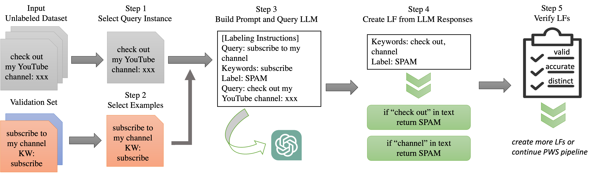
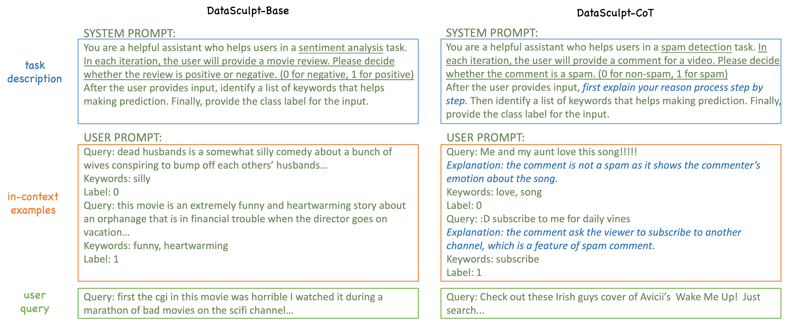

# DataSculpt: Automatic Label Function Development with Large Language Models


## Overview
The DataSculpt system is a framework for automatically developing label functions for weak supervision by prompting LLMs. It interactively selects query instances and ask the LLM 
to design label functions based on the query instances. It supports various LLMs for query, including GPT-3.5 and GPT-4 from OpenAI API
, and Llama-2 models from AnyScale API. It also incorporates various prompting methods, sample selection methods and LF filtration techniques.



## LF Space
Our framework supports two types of label functions: keyword-based LFs and pattern-based LFs. The keyword-based LFs are mostly used for 
text classification (e.g. sentiment analysis, topic classification) while the pattern-based LFs are mostly used for relation extraction (e.g. spouse, causal relation discovery).
The figure below illustrates our prompt templates.



## Installation
The following command installs the required packages. The code has been tested on python 3.8.19.
```angular2html
python -m venv .env
source .env/bin/activate
pip install ws-benchmark==1.1.2rc0
pip install pytokenizations
pip install transformers[sentencepiece]
pip install datasets
pip install torch torchvision torchaudio
pip install wandb
pip install alipy
pip install openai
pip install nltk
pip install tenacity
pip install tensorboardX
```

## Usage
### 1. Prepare the dataset
Our framework leverages the [WRENCH weak supervision benchmark](https://github.com/JieyuZ2/wrench) for unifying the dataset format. 
The textual datasets in WRENCH are automatically supported. New datasets need to be prepared following the WRENCH format. Note that the newly added datasets need to be registered in WRENCH by modifying `wrench/dataset/__init__.py`.
### 2. Run the framework
The framework is implemented in `main.py`. The following command runs the framework on the `imdb` dataset with GPT-3.5 as the LLM.
```angular2html
python main.py --dataset imdb --lf-llm-model gpt-3.5-turbo
```
The following command runs the framework on the `imdb` dataset with GPT-4 as the LLM, and apply self-consistency method to improve response accuracy.

```angular2html
python main.py --dataset imdb --lf-llm-model gpt-4-turbo --return-explanation --n-completion 10
```
The following command runs the framework on the `spouse` dataset with llama-2 as the LLM to develop pattern-based LFs.

```angular2html
python main.py --dataset spouse --lf-agent llama-2 --lf-type regex --lf-llm-model meta-llama/Llama-2-70b-chat-hf
```

To repeat the experiments in the paper, run
```angular2html
python batch_exp.py
```


## Paper
Please cite [our paper](https://arxiv.org/pdf/2311.00739.pdf) if you find our work helpful.

```
@misc{guan2023large,
      title={Can Large Language Models Design Accurate Label Functions?}, 
      author={Naiqing Guan and Kaiwen Chen and Nick Koudas},
      year={2023},
      eprint={2311.00739},
      archivePrefix={arXiv},
      primaryClass={cs.CL}
}